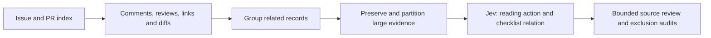

# Ibex: evaluate the evidence before deciding what to read

**Result:** every record in the 2,481-record source index was included in a completed Jev assessment with collected conversations, reviews and available linked code diffs. The unit is now a connected retrieval group, not an individual title/body record. This is triage, not an independently verified bug list.

## What changed

The preceding title/body pass left many records needing more context. This pass collects the evidence first, then asks Jev whether detailed human/Codex reading is worthwhile, which subject is involved, whether a property may go beyond the existing 24-item checklist, and what evidence is still missing.



## Collection and completeness

| Material | Collected |
| --- | ---: |
| Source issue/PR records | 2,481 |
| PR text diffs | 1,560 |
| Conversation comments | 5,043 |
| Inline review comments | 5,783 |
| Review summaries/states, including empty bodies | 4,841 |
| Explicitly linked standalone commit diffs | 27 |
| Connected retrieval groups | 1,804 |
| Evaluated inputs | 5,019 |

The collected text totals **136,071,281 UTF-8 bytes** before repeated prompt/partition context. **198 groups** required multiple inputs; the largest group contains 33 records. All 5,019 planned inputs have successful responses. Collection-count/file-coverage gaps recorded at packaging time: **0 groups**.

Conversation counts were reconciled with record metadata. GraphQL pagination was followed for review summaries, cross-reference/closure events and declared closing references. Inline comments include their supplied historical diff hunks. Each PR diff has a file-header count matching changed-file metadata. Explicit standalone-commit diffs also match the collected file lists.

Ten PR diffs needed recovery: nine exceeded GitHub diff API limits and were generated from pinned local Git merge-base/head comparisons, with changed paths checked against paginated GitHub file lists; one contained non-UTF-8 bytes and was decoded with a reversible Latin-1 byte mapping. Original recovery bytes and hashes are cached locally. See [recovery provenance](diff-recovery.json).

All **4,095 text atoms** were reconstructed from their ordered partition fragments and checked against source-text SHA-256 hashes and character lengths. This proves lossless partitioning of the captured, normalized text; it is not a claim that every HTTP byte stream or historical revision was archived verbatim.

**Scope limits:** the original 2026-09-28 index fixes membership, while comments and metadata were fetched later; GitHub is not a transactionally frozen snapshot. Final available PR diffs are included, not every intermediate patch revision. Attachments, binary contents, external repositories and full surrounding source trees were not ingested. Timeline collection covers cross-reference and closure events; other event kinds, including commit-reference events without an explicit collected link, are not exhaustively traversed. Bare abbreviated commit hashes without explicit repository URLs are not exhaustively resolved. General PR-to-PR or issue-to-issue references are indexed but not recursively expanded into the same input. Missing context can therefore remain even with complete collection for this declared scope.

## Grouping and partition decisions

Issue-to-PR references, closure information and matching commit revisions connect retrieval groups. Several records pointing to one explicitly linked standalone commit are grouped. General references are not asserted to be fixes. Each record and PR diff is stored in one group and partitioned once; inline historical review snippets can intentionally repeat code. This is retrieval deduplication, not proof that a group describes one root cause.

Small groups are sent together. Large groups are split into exact contiguous fragments with hashes and character offsets, retaining record identifiers/titles and a partial-context flag. A planning guard uses at most roughly 72 KB and 18,000 cl100k_base tokens for packed fragments; prompts and record context add overhead. This tokenizer is a proxy, not Jev billing. Eight calibration inputs, including the largest proxy inputs, were accepted before the full run.

Jev rejected 2 initial or refined inputs with its native token-limit error. Those inputs alone were subdivided, preserving every fragment and all successful cached requests. [Refinement provenance](context-refinements.json) links parent inputs to final children. Initial partition indexes remain in each payload; the group manifest lists the current leaf inputs.

Group routing is deliberately conservative: any part requesting a deep read selects the group; otherwise a missing part, collection gap, a fetch-evidence answer, or multiple parts retains it for context review. Only a complete single-input low-priority group is deferred. Multipart scores are not maximized or interpreted as bug probabilities. More parts create more opportunities for a positive reading signal, so group size is not evidence of severity.

## Before/after reading actions

For comparison, the earlier per-record title/body actions were regrouped over exactly these same members: any deep-read member makes a deep-read baseline group; otherwise any fetch-evidence member makes a fetch-evidence group. This aligns the units, but questions, grouping and collection time also changed. **It is not a controlled accuracy or input-only effect measurement.**

| Action | Regrouped title/body baseline | Comments and diffs included |
| --- | ---: | ---: |
| `deep_read` | 432 | 807 |
| `fetch_evidence` | 1,265 | 349 |
| `low_priority` | 107 | 648 |

| Baseline → evidence route | Groups |
| --- | ---: |
| `deep_read` → `deep_read` | 366 |
| `deep_read` → `fetch_evidence` | 43 |
| `deep_read` → `low_priority` | 23 |
| `fetch_evidence` → `deep_read` | 439 |
| `fetch_evidence` → `fetch_evidence` | 301 |
| `fetch_evidence` → `low_priority` | 525 |
| `low_priority` → `deep_read` | 2 |
| `low_priority` → `fetch_evidence` | 5 |
| `low_priority` → `low_priority` | 100 |

The 30 previously reviewed pilot PRs inherit these group actions: {'deep_read': 29, 'fetch_evidence': 1}. This is a sanity check, not an independent evaluation set. Inspect individual part answers before treating a group action as a conclusion about a member.

**187 groups** contain at least one `new_candidate` or `mixed` checklist-relation answer. These are model-generated leads beyond the existing 24 properties, not that many confirmed new properties or bugs. The existing checklist has not been expanded automatically.

## Measured usage and feasibility

| Pass | API input tokens | API output tokens | Input list-price calculation |
| --- | ---: | ---: | ---: |
| Earlier title/body routing | 3,398,951 | 531,549 | $0.142756 |
| This assessment with comments and diffs | 92,709,516 | 2,775,773 | $3.893800 |

This pass uses **27.3×** the earlier API input. Prices use $0.042 per million input tokens and free output for pinned `jev-1.13.0`, checked against [official model documentation](https://docs.typesafe.ai/models) on 2026-09-29. Counts are API-reported successful-response usage; cost is arithmetic, not an invoice. Recorded failed attempts: 5; failures without usage are excluded. The eight calibration successes are included once through request-hash caching.

The whole-evidence pass is feasible at this observed Jev cost, but it is not free of collection time or large-input overhead. Actual Codex session token totals/savings are unavailable. Jev reading millions of tokens does not mean those tokens were sent to Codex for source review. Final mechanism confirmation, applicability, oracle design and reproduction still require targeted work.

| Largest input-cost group | Source members | Inputs | API input tokens | Share |
| --- | --- | ---: | ---: | ---: |
| G02220 | #2220 | 1032 | 34,104,789 | 36.8% |
| G01981 | #1981 | 823 | 17,409,774 | 18.8% |
| G00754 | #754 | 90 | 2,355,550 | 2.5% |
| G02288 | #2288, #2289, #2324, #2326, #2398, #2444, #2445 | 93 | 1,803,949 | 1.9% |
| G00711 | #711, #840, #841, #848, #985, #1042, #1043, #1047 … | 64 | 1,478,315 | 1.6% |

Full members and exact costs are in [cost concentration](cost-concentration.json). Large vendoring/generated-content changes can dominate token consumption. They were retained in this experiment; a later explicitly scoped policy could treat such content separately, but this run did not silently omit it.

## Next bounded review queue

The proposed queue contains **27 groups**: 22 deep-read leads and 5 low-priority audits. The sum of prepared-payload proxy tokens is **97,635**, below the 100,000 planning ceiling. This includes Jev questions and is only a conservative planning metric, not actual Codex billing. Representatives are starting points; expanding to every member requires reassessing the detailed-reading budget.

Selection excludes groups containing the previous pilot PRs, rotates across correctness categories, prefers new/mixed checklist leads and smaller payloads, and reserves deterministic low-priority audits. The queue has not been independently source-reviewed.

| Representative | Upstream title (lead, not verified finding) | Purpose | Existing property matches |
| --- | --- | --- | --- |
| [#1710](https://github.com/lowRISC/ibex/issues/1710) | \[doc\] Documentation Improvement - catch all for documentation issues | exclusion_audit | none |
| [#1644](https://github.com/lowRISC/ibex/pull/1644) | Sim: Simple system: handle unused parameter | exclusion_audit | IBEX-022 |
| [#1751](https://github.com/lowRISC/ibex/pull/1751) | \[ci\] Move to spike-ibex-v0.4 | exclusion_audit | none |
| [#2148](https://github.com/lowRISC/ibex/issues/2148) | Floating-point support (software) | exclusion_audit | none |
| [#129](https://github.com/lowRISC/ibex/pull/129) | Trivial doc cleanups | exclusion_audit | none |
| [#2246](https://github.com/lowRISC/ibex/issues/2246) | mtvec.BASE aligned to 256 bytes bug | deep_read | none |
| [#1709](https://github.com/lowRISC/ibex/issues/1709) | \[dv\] Consider explicit PMP fail/pass checking | deep_read | none |
| [#2009](https://github.com/lowRISC/ibex/pull/2009) | \[rvfi\] Only catch LSU RF write data if it's actually valid | deep_read | none |
| [#2142](https://github.com/lowRISC/ibex/pull/2142) | \[bus\] Return error if decode fails | deep_read | none |
| [#399](https://github.com/lowRISC/ibex/pull/399) | \[RTL\] Prevent CSR write on any illegal CSR reason | deep_read | IBEX-002 |
| [#1948](https://github.com/lowRISC/ibex/issues/1948) | \[cosim\] Sort out error/pmp failure behaviour on unaligned accesses | deep_read | none |
| [#2028](https://github.com/lowRISC/ibex/pull/2028) | \[dv\] Add asserts to check alerts for memory integrity failures | deep_read | none |
| [#2311](https://github.com/lowRISC/ibex/issues/2311) | \[rtl\] IbexSimpleSystem missing instruction address check | deep_read | none |
| [#125](https://github.com/lowRISC/ibex/pull/125) | Check `rs1` & `rd` for non-CSR system instructions | deep_read | none |
| [#529](https://github.com/lowRISC/ibex/pull/529) | Update google_riscv-dv to google/riscv-dv@74b8cb6 | deep_read | none |
| [#2337](https://github.com/lowRISC/ibex/pull/2337) | \[rtl\] Stop rvfi from reporting load information on stores | deep_read | none |
| [#2258](https://github.com/lowRISC/ibex/issues/2258) | Ibex data memory interface through and bus adapters | deep_read | none |
| [#1942](https://github.com/lowRISC/ibex/pull/1942) | \[rtl\] Flush pipe on MSECCFG CSR write | deep_read | none |
| [#256](https://github.com/lowRISC/ibex/pull/256) | \[DV\] Make mtvec writable, remove previous workaround | deep_read | IBEX-016 |
| [#2231](https://github.com/lowRISC/ibex/issues/2231) | \[rvfi\] rvfi_pc_wdata doesn't consider mret/dret | deep_read | none |
| [#2453](https://github.com/lowRISC/ibex/issues/2453) | Trying another example | deep_read | none |
| [#2022](https://github.com/lowRISC/ibex/issues/2022) | fence instruction throwing unexpected illegal in RV32E congfiguration | deep_read | none |
| [#1878](https://github.com/lowRISC/ibex/pull/1878) | \[cosim\] Fixup ebreak behaviour | deep_read | none |
| [#191](https://github.com/lowRISC/ibex/pull/191) | RVFI: re-add accidentally removed `rvfi_intr` signal | deep_read | IBEX-021 |
| [#2323](https://github.com/lowRISC/ibex/issues/2323) | \[SecureIbex\] OpenOCD attach fails when SecureIbex=1 (works when SecureIbex=0) | deep_read | none |
| [#990](https://github.com/lowRISC/ibex/pull/990) | \[rtl\] Fix icache xprop issue | deep_read | none |
| [#1873](https://github.com/lowRISC/ibex/pull/1873) | \[dv\] Add test glitching PC of Ibex | deep_read | none |

## Artifacts and reproduction

- [Group results](group-results.json), [part results](part-results.json), [sortable queue](queue.csv), and [next-batch selection](next-batch.json).
- [Records](records.json), [groups](groups.json), [text-atom hashes](atoms.json), [relations](relations.json), and [standalone commits](standalone-commits.json).
- [Exact questions](questions.json), [preflight](preflight.json), [usage summary](summary.json), and [acquisition timestamps](acquisition.json).

Use Python 3, authenticated GitHub CLI, Git, and `tiktoken` for proxy sizing. Raw evidence stays under ignored local storage and credentials are supplied through the environment; only original summaries, links, hashes and typed evaluation outputs are published. Upstream material retains its original licenses.

```sh
python3 tools/ibex_pilot.py index
python3 tools/ibex_full_evidence.py collect
# For API-limited diffs, a blob-filtered clone must exist at .local/ibex/git.
python3 tools/ibex_diff_fallback.py
python3 tools/ibex_evidence_assessment.py supplement
python3 tools/ibex_evidence_assessment.py prepare
# Provide TYPESAFE_API_KEY via your environment or secret manager.
python3 tools/ibex_evidence_assessment.py evaluate --calibrate --workers 8
python3 tools/ibex_evidence_assessment.py evaluate --workers 16
python3 tools/ibex_evidence_assessment.py summarize
python3 tools/ibex_full_report.py
python3 -m unittest discover -s tools -p 'test_*.py' -v
```

Requests use payload-hash caches and per-request process locks. Native token-limit rejections cause lossless input refinement. Up to two retries are allowed only for transient HTTP 429/502/503/504 responses and are recorded. Other failures stop new submissions. A 200-million-input-token guardrail stops further requests in a run, with already in-flight requests allowed to finish; it is not a strict invoice limit. No RTL simulation, formal verification or new bug reproduction was performed by this pass.
